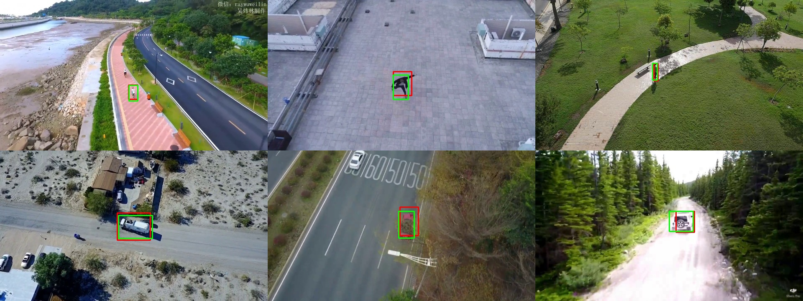

# Detekcja obiektów z wykorzystaniem głębokich sieci neuronowych zrealizowana na wbudowanej platformie obliczeniowej.

W pracy przedstawiono pełen proces projektowania sprzętowej implementacji systemu detekcji opartego o głębokie sieci neuronowe na potrzeby konkursu __*2021 DAC SDC*__.
Celem było zaproponowanie rozwiązania o dużej dokładności, wysokiej przepustowości oraz o niewielkim zużyciu energii. 
Na wstępnie omówiono wymagania oraz założenia konkursu, docelową platformę - __*Avnet Ultra96 V2*__, a także dokonano przeglądu dostępnych rozwiązań klasycznych oraz opartych o sieci neuronowe, w szczególności rozwiązań energooszczędnych. 
Następnie przedstawiono proces projektowania architektury sieci, wraz z treningiem i kwantyzacją oraz opisano implementację akceleratora sprzętowego, jak również próby optymalizacji zużycia energii. 
W rezultacie uzyskano dokładność detekcji __0.7015__ mierzoną współczynnikiem *IoU*, przy przepustowości __72.7 *fps*__ oraz zużyciu energii __2739 *J*__ dla __52 500__ obrazów.

# Object detection using deep neural networks implemented on an embedded computing platform.

This work presents the full process of designing hardware implementation of a detecton system based on deep neural networks for the *2021 DAC SDC* competition.
The aim was to design a solution with high accuracy, high throughput and low energy consumption.
The requirements and assumptions of the competition and the target platform - __*Avnet Ultra96 V2*__  were initially discussed, as well as the available classic solutions and solutions based on neural networks, especially energy-saving solutions, were reviewed.
Next, the process of designing the network architecture is presented, along with training and quantization, and the implementation of a hardware accelerator as well as attempts to optimize energy consumption are described.
The obtained result was the detection accuracy of __0.7015__, measured with the *IoU* coefficient, with a throughput of __72.7 *fps*__ and energy consumption of __2739 *J*__ for __52 500__ images. 
 
 

